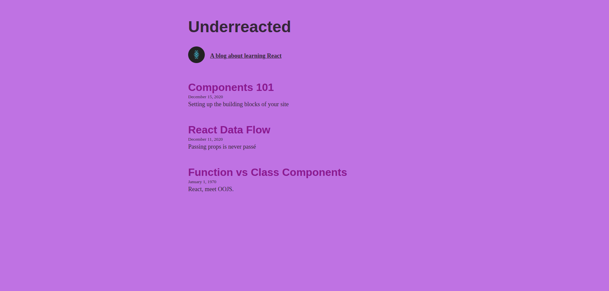

# 🖋️ Underreacted Blog

## 📝 Project Description
A React-based blog site that dynamically renders posts from a data file. This project demonstrates **Component Architecture**, **Props**, and **Mapping through Arrays**.

---
## 📷 App preview

## 🏗️ Component Structure
The application is broken down into reusable components to maintain a clean codebase:

- **App**: The main container that holds the state and data.
- **Header**: Displays the blog name.
- **About**: An aside section with the logo and "about" text.
- **ArticleList**: A container that loops through the blog posts array.
- **Article**: A reusable component for individual blog entries.

---

## 🛠️ Technical Logic

### 1. Dynamic Rendering
The app uses the JavaScript `.map()` method to iterate over the `posts` array in the `blogData` object. This allows the UI to update automatically if the data changes.

### 2. Conditional Defaults
In the `Article` component, I implemented a fallback for missing dates. If a post is missing a date, it defaults to **"January 1, 1970"** using the logical OR (`||`) operator.

### 3. Prop Drilling
Data is passed from the top-level `App` component down to `ArticleList`, which then passes individual post data down to each `Article` component using props.

---

## 🚀 How to Run the Project
1. Clone the repository to your local machine.
2. Install the necessary dependencies:
    `npm install`
3. Start the website:
    `npm run dev`
4.Click the link that appears in your terminal (usually http://localhost:5173).
